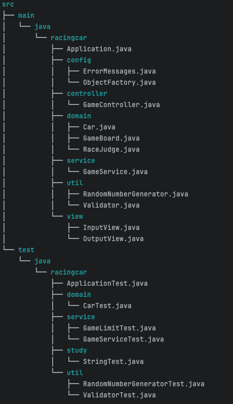

<div className="mx-auto max-w-xl">
  
</div> 

# 우테코 7기 2주차 미션 `자동차 경주`

# 서론

---
## 2차 공통 피드백을 보며

<details>
  <summary> 자세히 보기 </summary>
  
2주 차 미션의 학습 목표는 함수 분리와 테스트 도구의 사용법을 익혀 보는 것이었습니다. 새로운 개념을 학습하고 미션에 적용하는 과정이 쉽지 않았을 텐데요. 특히 다른 사람과 비교하다 보면 조바심이 생길 수 있습니다. 그렇지만 다른 사람과의 비교보다는 어제의 나와 비교하며 자신의 속도에 맞추어서 마무리하는 것을 목표로 삼아 보세요. 이번 경험이 좋은 프로그래머로 성장하는 중요한 역량을 키우는 과정임을 기억해 주세요.

입학 설명회에서 설명하였듯이 메타인지를 위한 최고의 도구 중 하나는 회고입니다. 회고를 통해 우리는 학습과 경험을 그냥 지나치지 않고 반성하고 개선할 수 있습니다. 아직 중간 회고를 작성하지 않았거나 회고를 공유하고 싶다면 프리코스 커뮤니티의 회고 채널에서 공유해 주세요. 한 주 한 주 지나면서 성장하는 여러분의 모습을 기대하겠습니다. 우아한테크코스 크루들이 쓴 내용이 궁금하다면 이 링크에서 회고록을 확인할 수 있습니다.

단위 테스트와 같은 용어가 아직 낯설 수 있지만, 작은 기능부터 테스트를 작성하는 연습을 차근차근 해 나가면  빠르게 성장하실 수 있습니다. 1주 차 피드백에서 제공된 문자열 덧셈 계산기 피드백 강의에 단위 테스트를 작성하는 내용이 있으니 이를 참고해 주세요.

이번 주도 여러분에게 의미 있는 시간이 되기를 바랍니다.

공통 피드백
README.md를 상세히 작성한다
미션 저장소의 README.md는 소스 코드 이전에 프로젝트의 개요를 소개하는 문서다. 이 문서를 통해 해당 프로젝트가 어떤 프로젝트인지, 주요 기능이 무엇인지 소개할 수 있다. 효과적으로 작성하기 위해 마크다운 문법을 검색하여 학습하고, 이를 활용해 README.md를 작성해 본다.
기능 목록을 재검토한다
기능 목록을 작성할 때 클래스 설계와 구현, 메서드 설계와 구현 같은 상세한 내용은 포함하지 않는다. 클래스 이름이나 메서드 시그니처, 반환값 등은 언제든지 변경될 수 있기 때문이다. 구현해야 할 기능 목록을 중심으로 작성하되, 정상적인 경우뿐만 아니라 예외 상황도 함께 정리한다. 예외 상황은 시작 단계에서 파악하기 어려우므로, 기능을 구현하면서 지속적으로 업데이트하는 것이 좋다.
기능 목록을 업데이트한다
README.md 파일의 기능 목록은 구현 과정에서 변경될 수 있다. 시작부터 모든 기능을 완벽하게 정리해야 한다는 부담을 갖기보다는, 기능을 구현하면서 문서를 지속적으로 업데이트하는 것을 목표로 한다. 이를 통해 죽은 문서가 아닌 살아있는 문서로 유지될 수 있도록 노력해 보자.
값을 하드 코딩하지 않는다
코드 내에서 문자열이나 숫자 값을 하드 코딩하지 않는다. 대신 상수(static final)를 정의하고 의미 있는 이름을 부여하여 해당 값이 어떤 역할을 하는지 명확히 드러낸다. 구글에 "java 상수"등의 키워드로 검색하여 상수 구현 방법을 학습하고 코드에 적용해 본다.
구현 순서도 코딩 컨벤션이다
클래스는 상수, 멤버 변수, 생성자, 메서드 순으로 작성한다. 

```java
class A {
    상수(static final) 또는 클래스 변수
    인스턴스 변수
    생성자
    메서드
}

```

변수 이름에 자료형은 사용하지 않는다
변수 이름에 자료형, 자료 구조 등을 포함하지 않는다. 변수 이름은 의미를 명확히 드러낼 수 있도록 하고, 자료형은 코드 작성 시점에 자연스럽게 이해될 수 있도록 한다.

```java
  String carNameList = Console.readLine();
  String[] arrayString = carNameList.split(",");
```

한 메서드가 한 가지 기능만 담당하게 한다
함수의 길이가 길어진다면 여러 기능을 한 함수에서 처리하려는 신호일 가능성이 높다. 예를 들어, 안내 문구 출력, 사용자 입력 처리, 유효값 검증 등의 작업을 한 함수에 모두 포함하는 대신, 이를 각기 다른 함수로 분리해 본다.

```java
  public List<String> userInput() {
    System.out.println("경주할 자동차 이름을 입력하세요(이름은 쉼표(,)를 기준으로 구분).");
    String userInput = Console.readLine().trim();
    String[] splittedName = userInput.split(",");
    for (int index = 0; index < splittedName.length; index++) {
        if (splittedName.length < 1 || splittedName.length > 5) {
            throw new IllegalArgumentException("`[ERROR]` 자동차 이름은 1자 이상 5자 이하만 가능합니다.");
        }
    }
    return Arrays.asList(splittedName);
}
```

메서드가 한 가지 기능을 하는지 확인하는 기준을 세운다
여러 메서드에서 중복되는 코드가 있다면 이를 별도 메서드로 분리하는 것을 고려한다. 메서드의 길이가 길어지면 여러 기능을 포함하고 있을 가능성이 커지므로, 15라인이 넘지 않도록 구현하면 의식적으로 메서드를 분리하는 연습을 할 수 있다.
테스트를 작성하는 이유에 대해 본인의 경험을 토대로 정리해본다
테스트를 작성하면 기능의 정확성을 점검함을 넘어 코드의 즉각적인 피드백을 받을 수 있다. 테스트 작성 과정을 통해 구현한 기능의 문제를 빠르게 발견할 수 있을 뿐만 아니라, 코드의 구조와 의도를 명확히 이해하는 데도 도움을 받을 수 있다. 학습 도구로도 활용할 수 있는데, 수 많은 테스트의 장점 중 본인이 가장 공감하는 작성 이유를 작성해 본다.

학습테스트를 통해 JUnit 학습하기.pdf
처음부터 큰 단위의 테스트를 만들지 않는다
테스트의 핵심 목적 중 하나는 코드에 대해 빠르고 자주 피드백을 받는 것이다. 처음부터 큰 단위의 테스트를 작성하게 되면, 작성한 코드의 문제를 발견하기까지 시간이 오래 걸린다. 따라서 문제를 작게 나누어 핵심 기능부터 작게 테스트를 만들어 가는 것이 효과적이다.

큰 단위의 테스트
자동차 경주 게임을 시작하여, 사용자가 이름과 진행 횟수를 입력하고, 게임을 진행한 후 결과를 확인한다.

작은 단위의 테스트
무작위 값이 4 이상이면 자동차가 전진한다.
무작위 값이 3 이하이면 자동차가 전진하지 않는다.
  
</details>

>2주 차 미션의 학습 목표는 **함수 분리**와 **테스트 도구의 사용법**을 익혀 보는 것이었습니다. 새로운 개념을 학습하고 미션에 적용하는 과정이 쉽지 않았을 텐데요. 특히 **다른 사람과 비교하다 보면 조바심이 생길 수 있습니다. 그렇지만 다른 사람과의 비교보다는 어제의 나와 비교하며 자신의 속도에 맞추어서 마무리하는 것을 목표로 삼아 보세요.** 이번 경험이 좋은 프로그래머로 성장하는 중요한 역량을 키우는 과정임을 기억해 주세요.
  
어찌 이렇게 내 마음을 알았는지 깜짝 놀랐고 내가 항상 나에게 하는 말을 적어주셔서 더 감명 깊었다.
힘들 때나 조급해질 때마다 스스로에게 하는 말인데..
좋다! 마무리하는 것을 목표로 좋은 경험을 하는 것을 목표로 달려보자.
아래의 공통 피드백을 보면서 2주차 회고를 시작하려 한다.
    
- README.md를 상세히 작성한다
- 기능 목록을 재검토한다
  구현해야 할 기능 목록을 중심으로 작성하되, 정상적인 경우뿐만 아니라 예외 상황도 함께 정리한다.
- 기능 목록을 업데이트한다.
- 값을 하드 코딩하지 않는다
- 구현 순서도 코딩 컨벤션이다
  클래스는 상수, 멤버 변수, 생성자, 메서드 순으로 작성한다. 
- 변수 이름에 자료형은 사용하지 않는다
- 한 메서드가 한 가지 기능만 담당하게 한다
- 메서드가 한 가지 기능을 하는지 확인하는 기준을 세운다
- 테스트를 작성하는 이유에 대해 본인의 경험을 토대로 정리해본다
- 처음부터 큰 단위의 테스트를 만들지 않는다
  
1주차에 비해서 노력을 한 결과인지 코드 리뷰를 통한 발전때문인지 공통피드백에 있는 부분들을 상당히 신경을 쓴 편이다.
그럼에도 불구하고 부족한 부분들이 꽤나 있다.
하드 코딩 미흡, 변수 이름에 자료형을 사용하고 싶어하는 마음이 있었다.
메서드가 한 가지 기능을 하는지 확인하는 기준 세우기.
처음부터 큰 단위의 테스트를 만들지 말기!
1, 2주차 미션을 하면서 가장 어려워하는 부분이 바로 기능을 나눠서 작은 테스트와 구현을 조화롭게 사용하는 것이다.
앞으로는 작은 테스트와 구현, 커밋을 실천해보자.
  
# 본론
  
---
## 문제 요구 사항

초간단 자동차 경주 게임을 구현한다.

- 주어진 횟수 동안 n대의 자동차는 전진 또는 멈출 수 있다.
- 각 자동차에 이름을 부여할 수 있다. 전진하는 자동차를 출력할 때 자동차 이름을 같이 출력한다.
- 자동차 이름은 쉼표(,)를 기준으로 구분하며 이름은 5자 이하만 가능하다.
- 사용자는 몇 번의 이동을 할 것인지를 입력할 수 있어야 한다.
- 전진하는 조건은 0에서 9 사이에서 무작위 값을 구한 후 무작위 값이 4 이상일 경우이다.
- 자동차 경주 게임을 완료한 후 누가 우승했는지를 알려준다. 우승자는 한 명 이상일 수 있다.
- 우승자가 여러 명일 경우 쉼표(,)를 이용하여 구분한다.
- 사용자가 잘못된 값을 입력할 경우 `IllegalArgumentException`을 발생시킨 후 애플리케이션은 종료되어야 한다.

### **입출력 요구 사항**

### **입력**

- 경주할 자동차 이름(이름은 쉼표(,) 기준으로 구분)

```
pobi,woni,jun

```

- 시도할 횟수

```
5

```

### **출력**

- 차수별 실행 결과

```
pobi : --
woni : ----
jun : ---

```

- 단독 우승자 안내 문구

```
최종 우승자 : pobi

```

- 공동 우승자 안내 문구

```
최종 우승자 : pobi, jun

```

### **실행 결과 예시**

```
경주할 자동차 이름을 입력하세요.(이름은 쉼표(,) 기준으로 구분)
pobi,woni,jun
시도할 횟수는 몇 회인가요?
5

실행 결과
pobi : -
woni :
jun : -

pobi : --
woni : -
jun : --

pobi : ---
woni : --
jun : ---

pobi : ----
woni : ---
jun : ----

pobi : -----
woni : ----
jun : -----

최종 우승자 : pobi, jun

```

## 진행 과정
  
지난 미션에서 시작하기에 앞서 시간이 너무 지체된 경험이 있었다.
앞으로도 마주칠 문제들을 어떻게 하면 빠르게 파악하고 기능 목록을 작성할 수 있을까? 에 대한 고민을 가지고 있었다.
1주차 미션을 끝나고 코드 리뷰를 하면서 MVC 패턴에 대해서 알게 되었다.
그래서 나도 아키텍처 설계에 대해서 생각하고 나만의 정리를 하였다.
  
MVC 가 무엇일까?
Model, View, Controller 구나
각자가 뜻하는 바는 무엇이지?
코드 리뷰를 하면서 도메인과 서비스도 봤는데 그건 무엇일까?
모델과 도메인이 다른건가? 컨트롤러와 서비스가 다른걸까?
나의 아키텍처는 우선 어떤 방식으로 하고싶니?
이러한 사고 과정을 거쳐 다음과 같이 정해졌다.

<div className="mx-auto max-w-sm">
  
</div>

```

Application -> Controller
View <- Controller -> Service -> Domain
Util, Config
```  

이러한 형태로 구조를 최종 설계를 하였다.
  
기능 목록 작성에 대해서도 1차 미션 때 책에서 읽은 내용을 바탕으로 적용하려 했다.
처음에는 "관점을 나누어서 해야지" 라고 생각을 했다.
큰 틀은 개념(도메인)관점에서 생각하여 객체들을 정하고
명세(책임 주도 설계)관점에서 메세지들을 정리하여 기능 목록을 작성을 하려 했다.
과제가 시작되었고 절차에 맞춰서 진행해보았지만 생각처럼 진행이 매끄럽진 않았다.
좀 더 명시적인 방법이 필요했던 것 같아서 방법론에 대해서 정리를 하였다.

### 2차 수정안
1. 핵심 기능 분석 및 객체 도출 : 무엇을 해야 하는가? 프로그램의 핵심 기능을 파악, 이를 수행하기 위한 객체를 구상
2. 객체의 책임 할당 : 각 객체는 어떤 책임을 가져야 하는가? 각 객체가 자율적이고 독립적인 역할을 가질 수 있도록 책임 할당
3. 객체 간 협력 정의 : 객체들이 서로 어떻게 소통할 것인가? 협력하는 방식 (메서드 호출, 데이터 전달 등)
4. 의존성 주입(DI) 설계 : 어떻게 객체 간 결합도를 낮출 수 있을까?
5. 팩토리 클래스 구성 : 객체 생성을 한 곳에서 관리하면 어떨까?
6. 구현 및 테스트 : 이제 각 객체가 제대로 동작하는지 테스트해보자.

기능파악 -> 역할할당 -> 협력정의 -> DI 및 팩토리설계 -> 구현 및 테스트

### 구현 및 테스트 상세 단계
1. 클래스별 구현 : 각 클래스가 설계된 대로 잘 동작하는지 확인하며 코드를 작성해야 해, 단일 책임 원칙 준수
2. 단위 테스트 작성 및 수행 : 각 클래스가 개별적으로 잘 동작하는지 확인해야 해
  ex) Domain 객체에 대한 Test
3. 객체 간 통합 테스트 : 객체들끼리 협력할 때도 잘 동작하는지 검증해야 해
  ex) Service 에 대한 Test
4. UI와의 통합 테스트 : 사용자에게 보여질 결과도 올바르게 나오는지 확인해야 해
  ex) View 에 대한 Test
5. 예외 및 엣지 케이스 테스트 : 모든 상황에 잘 대응하도록 예외 상황도 꼼꼼히 테스트해야 해
6. 최종 통합 테스트 및 리팩토링 : 전체 기능이 제대로 작동하는지 확인하고, 코드 개선이 필요하면 리팩토링하자
  
>2차 수정안을 위와 같이 사고의 흐름을 정해두고 흐름이 끊겨도 확인하며 절차를 진행했다.
도움이 된 것 같은데 회고를 하면서 확인한 결과 전체적인 과정을 미션이나 다른 문제들을 해결하면서 보완해야할 것 같다.
결론적으로는 큰 틀을 잡아놓고서 시작하는 것은 초보자인 나에게 네비게이션과 같이 좋은 효과를 보여준 것 같다.
어느정도 몸에 체득이 될 때까지는 이렇게 절차를 작성하는 것도 좋은 것 같다고 생각한다.

### RacingCar Code
  
```java
  public static GameController createGameController() {
  InputView inputView = new InputView();
  OutputView outputView = new OutputView();

  GameBoard gameBoard = new GameBoard();
  RaceJudge raceJudge = new RaceJudge();

  GameService gameService = new GameService(gameBoard, raceJudge);

  return new GameController(inputView, outputView, gameService);
  }
```
>의존성 주입을 하고 계속해서 의존성에 대해서 생각하다보니 누가 누구에게 의존을 하는지가 점점 보이기 시작했다.
그러면서 그렇다면 생성하고 주입하는 것을 한 곳에서 할 순 없을까? 란 생각으로 이런 설계를 하게 되었다.
이것이 좋은 것인지 나쁜 것인지는 아직까지 객관적으로는 모르지만 주관적으로 편했다.
그렇기 때문에 다음 미션에도 사용할 예정이다.

```java
private void playGame() {
	for (int i = 0; i < totalRounds; i++) {  
```
변수 i 에 대해서 round 같은 이름은 어떤가에 대해서 리뷰를 들었다.
좋은 생각이라 들면서도 정말 필요한가에 고민을 아직 하는 중이다.

```java
public void move() {
    int randomValue = RandomNumberGenerator.generate(RANDOM_MIN, RANDOM_MAX);
```
이 부분에 대해서 랜덤 값을 내부에 받는 것보다 외부에서 받는 것에 대한 고민을 구현하는 나도 했었고 지적도 받았다.
랜덤 값에 대해서는 외부에서 받는 것이 테스트하기에 좋을 것 같다는 판단이 든다.
                                        
```java
    public void initializeGame(List<String> carNames) {
        List<Car> cars = carNames.stream()
                .map(Car::new)
                .toList();
        gameBoard.setupCars(cars);                                    

```
스트림에 대해서 노션에 간단히 정리를 해보고 처음 사용을 해봤다.
  
- 배열이나 컬렉션의 요소들을 순차적으로 처리하거나 병렬 처리 가능
- Java 8에서 도입된 데이터 처리 추상화
- 메서드 체이닝 방식, 지연 연산 방식 ( 필요한 때만 데이터 처리 불필요한 중간 결과 생성 안함)
- 데이터가 배열(`int[]`, `Stirng[]`) → Arrays.stream(), List, Set→ 바로.stream()
- map.keySet().stream(), map.values().stream(), map.entrySet().stream()
forEach 와 같이 많이 적용해보면서 장단점, 어떠할 때가 적시적소에 사용하기 용이한지에 대해 앞으로 배워나가야 한다.

이 외에도
- 정규식 추가 공부 및 Pattern, matcher 첫 사용
- isEmpty, isBlank의 차이, strip 메소드 알게 됨
- Message, values 상수화 사용
- 메서드 호출 순서를 놓침
- @parameterizedtest 에 대한 부분
- No newline at a end of file!! ~~(일부러 지웠던 마지막 공백라인이...컴퓨터 입장을 다시 생각해보는 계기가 됐다.)~~

2주차에서 많은 것을 배울 수 있었다.
코드 리뷰 최고 👍
## 성찰
  
### 디버깅과 테스트
설계한대로 구현을 해나가며 기능 별 커밋에 신경을 썼다.
다만 테스트에 대해서는 생각을 정리를 안한 결과인지 이번 미션에서도 미흡한 부분이 컸고 숙제를 하듯이 구현을 끝낸 후에 했다.
지금 돌이켜보면 가장 부끄럽고 후회가 되는 점이다.
아직까지 디버깅보다 런을, 테스트보다 구현을
프리코스에서 요구하는 점들은 다 이유가 있다.
이유에 대해서 깊이 생각을 해봤다.
내 생각은 디버깅은 문제의 원인을 파악하는데 장점이 있는 것 같다.
그리고 테스트를 먼저 작성하는 것은 코드의 신뢰성을 높이고 명확한 요구사항 반영에 대한 장점이 있는 것 같다.
3주차에 잘 적용을 해봐야겠다.
  
### 코드 리뷰
이제 2번째 하는 코드 리뷰지만 처음과 별다른 차이없이 어려웠다
깃이나 커밋 등 여러가지들은 차이가 느껴지는데 왜 코드리뷰는 어려울까 생각을 해봤다
1. 자바 기본 문법 및 메소드 지식 부족
2. 편한 것만 하려는 성향
어떤 코드는 술술 읽히고 어떤 사람의 코드는 의식의 흐름이 따라가질 못한다.
코드를 읽으면서 그 사람의 사고를 느낄 수 있는 것 같다는 생각을 했다.
세상에는 다양한 사람들이 많고 역지사지의 중요성을 살아가면서 느낀다.
코드 리뷰를 하면서 이러한 경험을 할 수 있는 것을 처음 알았고 상당히 힘들었다.
나와 비슷한 경우는 쉽게 읽히지만 다른 경우나 모르는 경우 어려워서 1주차 코드 리뷰에서는 대충 이런 느낌인 것만 알면 넘어갔다.
마치 내가 아는 것 처럼...
그렇게 힘든 길을 피한 결과 2주차 코드 리뷰를 할 때에도 다른 부분들보다 성장이 느렸던 것 같다.
그래서 이번엔 정면 돌파를 하기로 했고 며칠을 코드리뷰에 사용을 했다.
~~(로또 미션 얼른 해야하는데...벌써 목요일이라고오!!)~~
설명회에서 말한 **내가 모르는 것을 아는 것**이 왜 중요한지 다시 한 번 느꼈다.
그래서 빠르게 3주차 미션을 시작도 해야하지만 미뤄두고 코드리뷰에 집중을 했다. 🥲
그 결과 다른 분의 코드지만 마치 내 코드처럼 술술 읽히는 성과를 거둔 것 같다.
더불어 모르는 용법에 대해서도 재밌게 공부할 수 있었다.
앞으로 코드만 있으면 무엇이든 가능하겠다는 무서운 생각도 들긴 했다.

# 마무리
---
## 아쉬운 점
기억에 남는 것은
1. README 체크박스 만들어두고 체크를 하지 않았다...
2. 경주 게임인데 참가자가 한명일 경우를 생각 못한 것

## 다음 목표
- 체력이 곧 정신력이다. "틈날 때마다 강한 체력을 기르자!"
- 몰입, 메타인지, 집단지성, 설득(논리적글쓰기) 기존 목표를 꾸준히 각인하고 실천하기!


>마지막으로 스스로에게 하고 싶은 말이자 여러분에게도 도움이 되고자 한 마디 남기고 이번 회고를 마치겠다.
>"Do what is hard, and your life will be easy. Do what is easy and your life will be hard."
  
---
