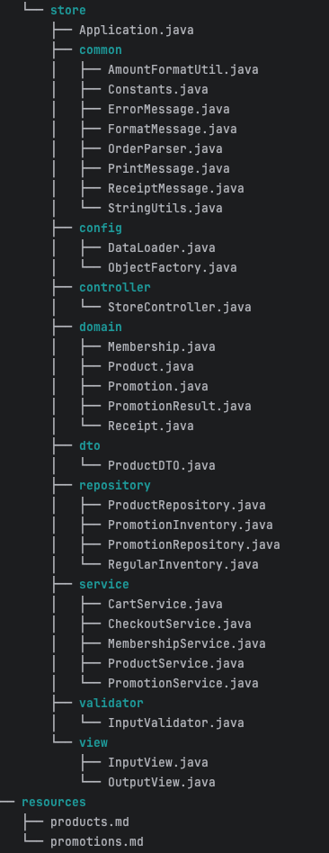

<div className="mx-auto max-w-lg">
  
</div> 

# 서론
**1, 2, 3주차 미션과 달랐다.**

부족한 능력으로 제대로 구현하지 못하고 제출하게 됐다.

이전 미션 과제를 진행하면서 우아한테크코스에서 제공한 **학습 목표와 공통 피드백**을 **어떠한 방법**으로 **소화**했는가에 따라 이번 미션의 결과에 큰 영향을 미쳤을 것이라고 개인적으로 생각한다.

**미션의 목표**

> 편의점 결제 시스템을 구현한다.

**할인 혜택**이 있고 재고를 고려해야 한다. 
할인 혜택에는 프로모션 증정 할인이 있고 멤버십 적용 할인이 있다. 
**재고 관리**는 초기에 제공된 Resource 파일을 이용해서 등록해야 한다. 
일반, 프로모션 상품을 각각 차감하고 업데이트할 수 있어야 한다. 
결제를 진행할 때 조건에 따라 안내해야 한다. 
프로모션 적용과 멤버십 적용에 따른 안내가 필요하고 최종적으로 계산하여 영수증을 제공하는 시스템이 목표다.

한 주 동안 미션을 통해 경험한 것들을 아래의 내용에 설명하려 한다.

# 본론
## 과제 진행 요구 사항
이전 미션과 같이 나의 원격 저장소에 생성을 하면서 시작된다.

**기능 구현을 하기 전 README에 구현할 기능 목록을 정리해야 한다.**
- 한 번에 완벽하게 하려는 생각보다는 수정을 통해 조금씩 나아가며 완성한다는 마음으로 시작하는 것이 중요한 것 같다.
- 처음 보는 다른 사람이 리드미를 보고 프로젝트에 대해 이해하고 똑같은 환경에서 시작할 수 있는 것이 중요한 것 같다.

**AngularJS Git Commit Message Conventions을 참고하여 진행해야 한다.**
- 버전 관리가 왜 중요한지 이번 과제를 통해 중요성을 느꼈다. 나의 생각과 달라지는 현상이 발생할 때 돌아갈 수 있느냐 없느냐, 어디로 돌아갈 수 있는가에 대한 소중함과 후회를 다양하게 겪을 수 있었다.

## 기능 요구 사항

재고 상황을 고려해서 구매자가 상품을 장바구니에 담을 수 있고 결제를 진행할 때 할인 혜택을 적용할 수 있다. 구매자는 영수증을 통해 정보를 획득할 수 있다.

미션을 진행하기 전 계획이 있었다.

기능 명세를 문장으로 작성하고 책임을 작은 단위로 계속 나눈다. 
단일 책임을 지닌 개념을 식별해서 객체를 할당한다. 
책임을 수행하기 위한 행동을 정의한다. 
행동할 때 필요한 상태를 가지게 한다. 
쉬운 도메인 객체부터 테스트 및 구현한다. 
테스트는 Red, Green, Refactor의 과정을 진행한다. 
입출력 예시를 보고 시나리오, 워크플로우를 작성한다. 
객체 메시지를 통해 서비스와 컨트롤러를 구축한다. 
도메인 개념은 객체지향적 설계를 하고 서비스와 컨트롤러는 절차지향적 설계를 한다. 
서비스는 비즈니스 로직을 다룬다. 
컨트롤러는 사용자의 인터페이스 입력 처리(서비스) 출력만을 다룬다.

> "누구나 그럴싸한 계획을 갖고 있다. 쳐맞기 전까지는."

미션이 시작됐고 계획대로 진행을 시도했다. 하지만 구체적으로 정의하는 것들이 어려웠다. 단일 책임, 작은 단위 테스트 설정, 비즈니스 로직 정리 등 적고 수정하는 것을 반복했다.

시작하기 전에 공통 피드백을 봤고 동영상처럼 하고 싶어서 따라 해봤다. 기능 명세 문장에서 작은 테스트로 정리하는 것이 생각처럼 잘되지 않아 어려움을 겪었다.

상품에 가격이라는 필드를 설정하고 상품별 총구매액을 계산하는 행위를 하다가 서비스에 연산을 옮기고 상품에서는 getter만을 사용했다가 상태를 가지는데 행위가 없는 것을 이상하게 생각하고 바꾸는 등 이랬다 저랬다하는 혼란을 다양한 부분에서 느꼈다.

변경에 초점을 두고 설계를 하자는 등 설계에 신경을 쓴 탓에 잦은 설계 변경이 일어났고, 오히려 그것이 패착을 부른 것 같아 아쉽게 생각한다. 아래는 제출하기 전 나의 프로젝트 구조 모습이다.

### 프로젝트 구조

<div className="mx-auto max-w-sm">
  
</div>

상품, 장바구니, 프로모션 할인, 멤버십 할인, 인벤토리(재고), 영수증에 대해서 많이 고민했다.

**보유한 상품 정보 출력**
`<계획>`
리소스 파일에 있는 정보를 가져와 상품과 프로모션 레포지토리에 저장하려 했고 레포지토리는 CRUD에 집중하려고 했다. 상품 레포지토리에서 일반, 프로모션 각각을 나눠서 다루려고 했다.

`<실행 결과>`
보유 상품을 순서대로 출력해야 하는데 각각을 따로 관리하려다 보니 출력이 원하는 순서대로 나오지 않았다. 데이터로더를 통해서 레포지토리에 저장하고 원하는 순서로 출력하는 것이 어려웠다. 입출력 예시를 보면서 뒤늦게 프로모션 상품이 있으면 일반 재고가 없더라도 재고 없음으로 출력하고 프로모션 상품이 없을 때만 일반 재고를 출력하는 것을 늦게 알아서 데이터로더와 상품 레포지토리를 자주 고쳤다.

```java
    private void addProduct(List<Product> products, String name, int price, int quantity, String promotionType) {
        if (promotionType != null) {
            Product promoProduct = new Product(name, price, quantity, promotionType);
            products.add(promoProduct);

            Product regularProduct = new Product(name, price, 0, null);
            products.add(regularProduct);
            return;
        }
        Product regularProduct = new Product(name, price, quantity, null);
        products.add(regularProduct);
    }
```
위와 같은 방법으로 프로모션과 일반 상품 모두를 표시하도록 했고 레포지토리에 순서대로 입력된 원본 리스트를 가지도록 하였다.

Promotion, Regular Repository를 각각 만들고 ProductService를 통해서 재고 관리를 하려고 했는데 실패했다.

총재고를 기존의 ProductRepository에서 저장해 놓은 각각의 레포지토리에서 가져와 더하는 메소드를 따로 만드는 방법을 이용했다.

보유 상품 출력에 관해서도 Product, ProductDTO, ProductRepository, ProductService, Controller, outputView의 도움을 받아서 출력했다.

**구매할 상품 정보 입력**
`<계획>`
Cart 객체를 만들어 각 상품명의 수량을 전달하는 목적으로 만들려고 했다.

미션 초기에 상품에서 상품별 총구매액을 계산하고 장바구니에서 장바구니 총 구매액을 계산하는 시도도 했다가 CheckoutService에서 금액 계산에 대한 책임을 넘겼다.

상품을 입력할 때 Repository에 존재하는 상품인지 수량도 함께 검증하도록 계획했다.

`<실행 결과>`
ProductService에서 Repository 정보를 이용했다. Cart 클래스를 만들고 CartService를 사용했다. 
CartService에서 Repository에서 바로 정보를 가져와 장바구니 역할을 맡게 하다 보니 Cart 클래스를 사용하지 않게 되어서 최종적으로는 Cart 클래스를 지우게 됐다.

**프로모션 할인**
`<계획>`
프로모션의 정보는 PromotionRepository에 생성한다. 프로모션 객체는 프로모션의 기간, 증정품 계산, 검증을 맡겼다.

`<실행 결과>`
PromotionService에서 Promotion 클래스의 메소드를 이용하여 기간이 해당하는지 증정품 계산과 검증을 이용했다. PromotionResult라는 클래스를 만들어 프로모션 정보를 관리하도록 했다.

프로모션의 재고가 충분하고 2+1일 경우, 고객이 2개만 가져왔을 때 프로모션 적용으로 하나를 추가하거나 총재고에는 들어가나 프로모션의 재고가 부족할 경우 정가로 결제할 것인지 안내를 하는 기능 구현에는 실패했다.

초기에 기능 요구 사항을 잘못 이해한 부분이 있어서 나중에 고치다가 정작 기능 요구 사항을 마무리하지 못하였다. 
아쉬운 마음이 많이 남는다. 가장 중요한 기능인데 허술하게 했다.

**멤버십 할인**
`<계획>`
프로모션 미적용 상품에 대해서 멤버십 할인 여부에 따라 진행한다.

`<실행 결과>`
처음에는 가격으로 접근했다. 
총 구매액을 구하고 프로모션 할인 금액을 구하고 그것을 차감한 금액에 멤버십을 적용했다. 
하지만 프로모션 적용에 해당하는 품목은 모두 프로모션 적용인 것을 잘못 생각했다. 
그 결과 새롭게 수정하는 과정을 거쳤다.

**계산대 최종 금액 계산**
`<계획>`
장바구니 상품 별 프로모션 할인을 체크하고 멤버십 체크 후 최종 결제 금액을 계산하여 영수증 생성에 필요한 정보를 넘기는 것으로 설계했다.

`<실행 결과>`
재고 관리와 프로모션 적용이 미흡하여 최종 결제 금액과 영수증 출력에도 영향을 미쳤다.

**영수증 출력**
`<계획>`
CheckoutService에서 생성된 구매 내역, 증정 상품 내역, 금액 정보를 출력할 계획이었다.

`<실행 결과>`
실행 예시의 형태와 완전히 일치해야 하는 줄 알았다. 
공백까지 맞추려고 노력했는데, 그것보다 올바른 정보와 값에 집중할 걸 그랬다. 
프로모션 적용을 거치면서 상품 총 구매액과 총 수량 등 값이 올바르게 전달되지 않아 아쉽게 생각한다. 
마음이 너무 급했던 것 같다. 
테스트 주도 개발과 디버깅을 통해 단단하게 구축했으면 좋았을 것 같다.

**추가 구매 여부**
`<계획>`
구매 결과에 대한 ProductRepository 재고 업데이트를 한다. 추가 구매 여부에 대한 질문을 하고 'Y'를 입력할 시 처음부터 돌아가서 반복한다.

`<실행 결과>`
ProductRepository에 대한 업데이트는 결제할 영수증에 넘길 정보를 계산하는 과정의 시작 부분에서 차감하도록 구현했다.

checkout이라는 메소드에서 영수증 객체에 데이터를 넘겨서 영수증 객체를 반환하도록 했다.

# 결론

## 아쉬운 점
모든 것이 아쉽다.

**클래스 상속을 이용한 상품 설계**

Product, PromotionProduct 상속을 이용하기로 했는데 장바구니를 Map을 이용하여 관리하는 것에서 문제가 발생했다.
equals, hashcode, Map에 대한 이해가 부족하여 제대로 활용하지 못한 점이 아쉽다.
무한 루프에서 빠져나오지 못하여 결국 새롭게 다 엎고 Product만을 사용하는 설계로 변경했다.

위의 내용에 대해서는 추가적으로 공부하여 새로운 글로 올리도록 해야겠다.

**테스트 주도 개발**
도메인과 레포지토리, 특정 서비스까지 실패할 테스트를 선 작성하고 통과하게 하고 리팩토링하는 과정을 거쳤다.
여러 가지 문제가 발생했고, 시간에 대한 멘탈적 압박으로 인해 구현에만 집중했고, 그로 인해 버전 관리 및 테스트가 망가졌다.
커밋에 대해서도 보여진다는 생각으로 좀 더 완성하고 커밋하려다가 돌아갈 포인트를 놓치는 경험도 많이 했다.
설계가 자주 변경되면서 특정 테스트만 실행하려 해도 이전 테스트들의 에러로 인해 진행하지 못하여 @Disable을 이용하기도 했고, 그 또한 먹히지 않아 해당 테스트들을 다시 잡는 과정을 여러 번 하다 보니 그 당시에는 방해로 느껴졌다.
마음이 최종적으로 너무 급해졌고 테스트를 족족 삭제해버리는 과정을 거쳤다.

지금 돌이켜보면 버전 관리와 테스트들을 잃고 나니 기능 구현이 더 갈피를 잡지 못했던 것 같다.
기능 구현을 못하더라도 그동안 배운 것들을 실천하는 것이 더 중요한 것이 아니었나? 
내가 출제자라면 과연 요구 사항을 열심히 지키면서 구현을 다 못한 코드와 수단과 방법을 가리지 않고 테스트 통과에만 급급한 코드 중 무엇을 좋게 바라볼 것인지를 생각해보니 후회가 된다.
기본 도메인의 기능을 탄탄히 하고 비즈니스 로직에 대한 탄탄함을 쌓아야 하는 점에 대해 깊은 후회를 느낀다.

테스트와 디버깅에 대해서 추가적으로 많이 공부하고 실전 연습을 쌓아야겠다.
생각의 속도를 구현으로 따라가지 못하는 것이 지금의 답답한 심정이다.

**생성형 인공지능**

개발을 시작한 지 얼마 되지 않았고, 그동안 인공지능의 도움을 많이 받아왔다. 
이번 프리코스 과정에서도 AI에게 의존하는 부분이 많았다. 그 결과가 이번 미션의 참패라는 것을 깨달았다. 
사실 이전 미션에서도 계속 느끼고 있었다. 
이렇게 의존하면 안 된다고. 
의존 없이 진행하다가 주말까지 몰리면 결국 다시 꺼내게 됐다. 아직 나의 역량이 그만큼 모자란 것 같다.

이번에 AI와 다툼을 하며 디테일한 문제에 대해 몇 시간을 해결하지 못한 것도 직접 잠깐의 디버깅으로 해결되는 일을 겪었다. 
그때라도 직접 디버깅을 계속했었어야 했는데, 급한 마음에 그렇게 하지 못했다. 
그 점이 후회된다.

예전 수학 관련 문제에서도 같은 현상을 겪어서 항상 의심하는 것을 생각했지만, 지난 미션 동안 계속 사용했던 것이 쌓여 나의 역량을 부족하게 했고, 이번 미션에서 오히려 시간 낭비를 불러오고 기존 설계가 엉망이 되는 것을 느꼈다. 
그런 도구를 사용하는 것도 기본이 갖춰져야 한다는 것을...

앞으로 AI 사용을 최소화하고 직접 다시 구현하는 작업을 진행할 것이다. 
미션을 다시 진행하면서 필요한 문법들 하나하나를 책과 구글링을 통해 배우는 과정을 겪어보려 한다. 
이번 동일성, 동등성 등 개념 문제도 구글링을 통해 직접 깊이 이해하고 올바른 질문을 했다면 달랐을 것 같다. 
인공지능을 사용하면 좋은 부분과 아닌 부분에 대한 경계점을 더욱 명확하게 인식하게 된 것 같다.

## 마무리

4주차까지 프리코스 과정을 거치면서 시간의 소중함을 더욱 절실히 느꼈다. 
원하는 것을 이루기 위해서 다른 무언가를 포기해야 했는데 담배를 끊었었다. 
이번 프리코스 기간을 통해서는 술을 끊게 됐다. 시간의 소중함을 느꼈기 때문이다.

이번 프리코스를 통해 객체지향과 여러 가지를 배우면서 읽고 싶고 배우고 싶은 지식들이 아주 많이 생겼다. 
읽고 배우며 공유하면서 내 지식으로 단단하게 만드는 과정을 겪자. 
읽고 배우고 그것이 내가 아는 것인 듯 넘기지 말고, 공유하면서 진짜 나의 지식인지 확인하는 과정을 거치자.

늦은 시작이지만 앞으로의 나의 인생을 개발자로 사는 것에 올인하고 싶다. 
프리코스 과정을 거치면서 마음이 더 커졌다. 앞으로도 나의 의지는 강해지고 꺾일 일이 없다고 자부한다고 생각한다. 
다만 건강, 신체가 튼튼하고 강건해야 정신도 곧게 설 수 있다고 프리코스 과정에서 느꼈다. 
목이 아프고 눈이 아프고 이곳저곳이 아프다. 
오랫동안 꾸준히 성장하고 싶다면 건강 관리를 잘해야겠다고 느꼈다. 건강이 무엇보다 우선이다!

>혹시 방문하여 긴 글을 읽어주셨다면 감사합니다. 
여러분도 다른 건 모르겠지만 꼭 건강 관리하시길! 
아프지 마시길 바랍니다 😊


