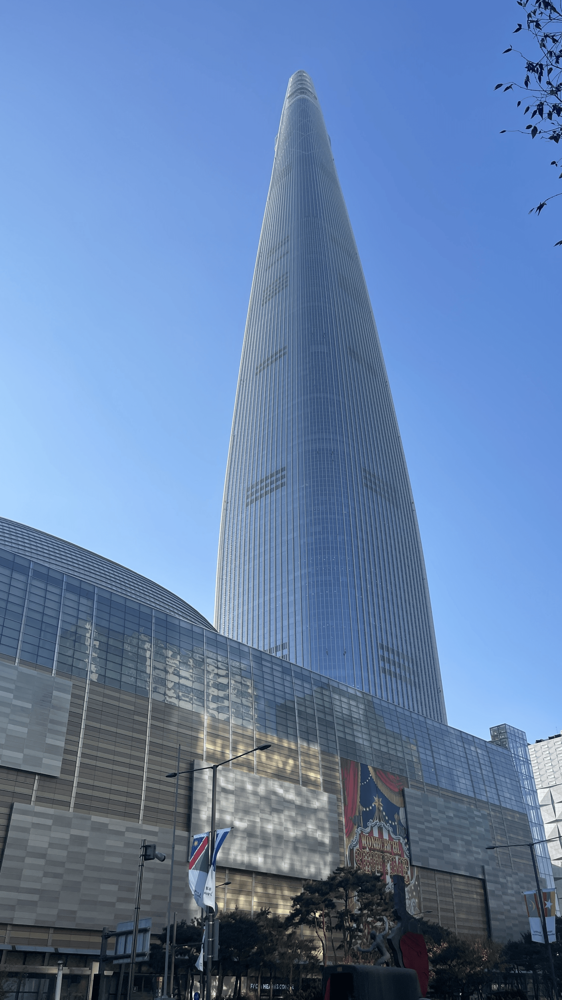

  

 

### 내가 최종 코테를?

4주차 편의점 미션을 정해진 규칙을 지키지 못했고 기능 구현이 잘못된 상태로 끝났었다.
테스트는 통과를 했지만 기능들 구현이 부족하고 프로그래밍 요구 사항도 지키질 못해서 기대를 내려놨었다.

학교 공부를 했고 그래도 혹시나? 라는 생각에 조금 시간을 내어서 우테코 코테 준비를 하려했었다.
하지만 학교 공부도 시간이 많이 부족하여 예상과 다르게 학교 공부에만 전념하게 되었다.

결과는 최종코테 참가 기회가 주어졌다!

정말 너무나도 기뻤다.

특히 내가 퇴사를 하고 전혀 무관한 분야에 발을 내딛기도 했고 자바를 처음 경험했는데 내 선택이 틀리지 않았고
앞으로도 노력을 하면 된다고 처음으로 인정해준 것 같아서 그 순간 벅차오르고 기뻤던 것 같다.

### 제대로 넘어지다

하지만 지금 생각해보면 나에겐 몇가지 큰 문제가 있었다.

첫째, 애초에 난 프리코스 준비과정에서 모르는 지식이 생길 때마다 GPT를 통해서 개념을 쌓아왔다.
당연히 구글링과 독서, 유튜브등 여러 가지 공간에서 정보를 습득하였었지만 주로 GPT를 통해서 배웠다.

둘째, 연습을 TDD로 단위테스트에 집중해서 천천히 꼼꼼하게 새롭게 연습을 했다.
하지만 마지막 일주일전부터 테스트 진행을 생략하고 컨트롤러에 모두 구현, 서비스에 모두 구현 등 방법을 바꿔가기 시작했다.

셋째, 뒤늦게 공부한다고 매일 매일 새벽 4시에 자거나 정서적으로 신체적으로 컨디션 조절을 못했다.

이러한 것들이 실제로 최종 테스트를 치러간 날, 나에게 큰 영향을 줬던 것 같다.

당일 아침부터 카페에 가서 준비를 했고 시작 전부터 허리 통증도 있고 눈 앞도 흐려지는 등 그때부터도 컨디션이 좋지 않았던 것 같다.
시작할 때 머리가 멍했고, 1시가 되면서 지원페이지를 새로고침하였지만 변화가 없어서 당황을 했다.
주변엔 다 시작을 한 것 같은데 나는 허둥지둥했다.
몇 번 더 새로고침을 했고 심호흡을 하면서 차분하게 요구사항을 읽어갔다.
이상하게 읽어도 읽어도 머리가 멍했고 연습 부족의 결과가 그때 찾아온 것 같다.
연습을 할 때엔 협력 메세지를 먼저 작성하고 거기에서 책임을 나누고 그곳에서 도메인을 식별을 했다.
그리고 도메인을 통해서 기능과 검증을 진행하고 서비스에서 비즈니스로직을 진행한다.
컨트롤러에서 뷰와 연결을 하여 디버깅을 하면서 연습을 했었는데 실전에서는 기능 목록 작성부터 망했던 것 같다.
생각이 많았고 나눠서 단순하게 생각하질 못했다, 다 나의 실력 부족이다 🥲

### 나의 맥북 에어가 처음으로..

시작을 하고 노션 페이지가 멈췄고 이어서 크롬도 멈췄다.
처음 겪는 일이었다.
다행인지 불행인지 인텔리제이는 멀쩡했지만 빠르게 재부팅을 했어야했는데 
나는 여태 재부팅을 하거나 프로그램 강제종료를 하는 법도 모르고 있었다.
인텔리제이는 작동을 하여서 멍한 정신 상태로 계속해서 진행했다... 막무가내로...

### 막혔던 점

LocalDateTime, 시간을 다루는 것이 부족했다.
빠르게 구글링을 했어야했다.
기능 목록 작성을 못했고 그 상태에서 어거지로 입출력을 보면서 차례대로 절차적으로 프로그래밍하려고 했다.
변수명도 구별하기 힘들게 적었고 총체적 난국이었다.
그럴수록 머릿속은 더욱 망가져갔고 멘탈적으로 지금 생각해보면 너무 이해가 안가는데...
지나간 일이니깐 좋은 경험이라고 생각할 수 밖에 없다.

다 잘못된 연습 방법과 부족한 연습량, 학교 공부를 한다고 모든 것을 쏟지 못한 부분, 다른 사람들의 코드를 보며 급하게 지금 껏 해왔던 연습 방법을 바꾸고 모든 것을 바꾸려고 했던 점 등 나의 지난 행동들에 의해서 그런 경험을 겪게 되었던 것 같다.

**가장 아쉬운 부분은 시간이 걸리더라도 요구 사항 기능 목록을 차분하게 작성했어야 했다.**
연습을 할 때, 기존 나의 방법에서는 단위테스트를 하면서 오히려 시스템의 요구사항과 구조들이 정립이 되었는데
그것을 안하니깐 구조가 어지러워서 아무것도 못했다.
즉, 나누어서 생각을 못한 것 같다.

요구 사항을 여러 번 읽고 머리속으로 이해를 하고 하던지 도메인 식별하여 하나씩 하던지 했어야했는데 그것이 아쉽다.
그리고 .을 찍어서 여러 메소드를 직접 프린트 해보면서 메소드를 찾았던 게 후회된다.
GPT에게 물어보듯이 그냥 구글링을 했어야 했는데 시간 낭비가 너무너무 심했다.
~~이제부터는 모두 구글링 할래! GPT와 결별 선언 😭~~

연습을 할 때에 enum이 너무 좋았기 때문에 Month 와 같이 여러 가지들을 모두 enum으로 구현을 하려했는데
Time 기존 유틸과 겹치면서 당황을 한 점에서 특히 시간을 많이 뺐겼다.

안하던 짓으로 MVC 구조를 먼저 잡아두고 했더니 아무것도 못했다.
~~돌아가는 쓰레기를 만들어야한다고!!!!~~

멍한 정신 상태에서 겪은 문제들에 대한 대처들이 나의 선택들이 너무 후회가 된다.
실컷 잠도 자고 컨디션 회복하고 다시 보니깐 너무 간단하게 보이는 것들을 왜 생각 못 했는지... 지금 보니깐 너무 아쉽다.

항상 컨디션이 안좋더라도 시험 당시만 되면 정신 번쩍, 무엇이든 잘 했었던 경험이 있는데
내 생각보다 컨디션도 중요하구나 라는 것을 이번에 크게 경험을 해보게 됐다.
~~실전과 같은 연습과 계속해서 밀고 나가기 그리고 잠을 잘 자자, 운동도 하고!~~

### 소감

결국 시험은 끝이 났고 일어나서 가방에 짐을 챙기고나서 마음 속 깊은 곳에서 울컥함이 강하게 올라왔다.
그동안의 노력이 스쳐갔고 실력 발휘를 평소의 반의 반, 그것의 반의 반도 못한 것이 너무나도 슬펐던 것 같다.
어렵거나 문제가 생기더라도 그래도 있는 실력을 어떻게해서든 보여주는 경험을 했었는데
처음으로 이러한 경험도 해보니깐 좀 더 힘들었던 것 같다.

부끄럽지만 이미 지나간 일이다.
나를 위로하기 위해서 여러 가지 생각을 했고 그 중 나를 위로해줬던 생각을 적어본다.

>인생은 마라톤이라고 생각한다.
지금 한 구간에서 넘어졌다.
내가 무엇을 하면 되는가?
단순하다, 일어서서 다시 달리면 된다.

현재는 마음을 추스린 상태다.
이번 경험에 대해서 정말 좋은 기억으로 생각한다.
이러한 경험을 못했더라면 언젠가 경험했을 수도 있다고 생각하고
우테코 프리코스에 참여한 좋은 분들에게서 너무나도 좋은 기운들을 얻었고
프리코스를 진행하면서 깨닫게된 많은 지식이 있다.

앞으로의 계획도 세웠고 하나씩 꾸준하게 해나갈 것이다.
Stay Hard!

