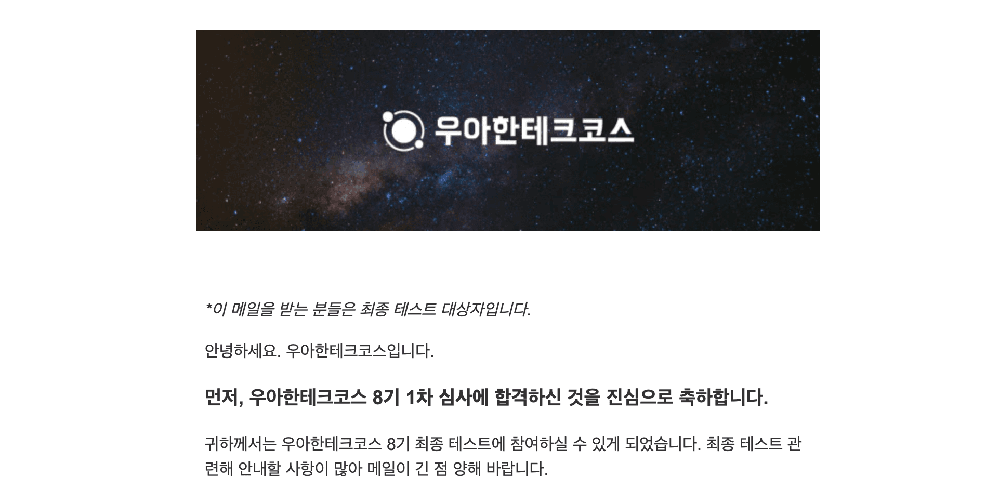
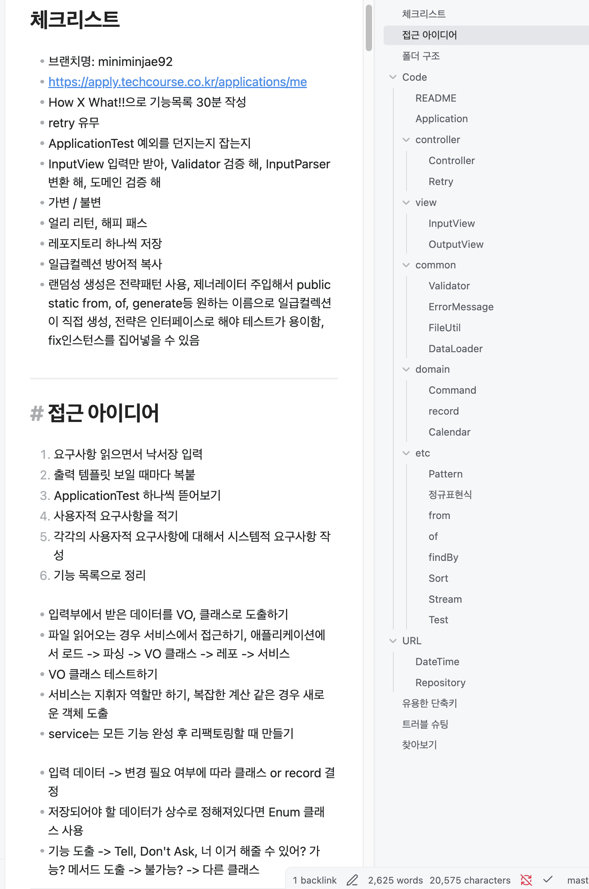
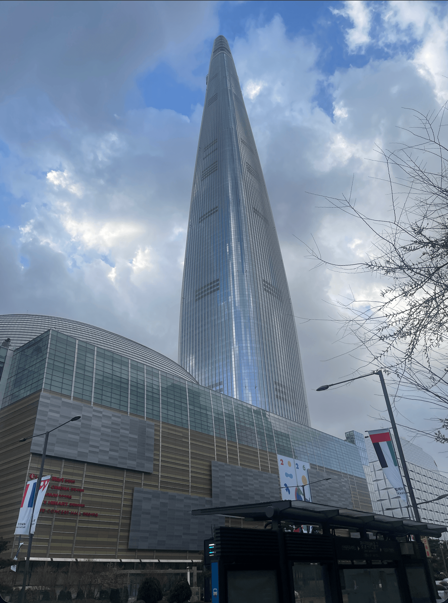

# 1차 심사 합격!!!

<div className="mx-auto max-w-full my-12">
  
</div>

오픈 미션을 진행하면서 나에게는 큰 도전이었지만, 객관적인 시선에서는 큰 영향이 없을 수도 있겠다고 생각하면서 기대를 낮추고 있었다.
하지만 운이 좋게도! 다시 한번 최종 기회가 주어졌다.
기쁘면서도 작년의 망쳤던 기억이 함께 떠올랐다.

**똑같은 실수를 또 반복하고 싶진 않았다.**

# 준비 과정

7기 ~ 4기까지의 4주차와 최종 코테 문제들을 풀었다.
시간 내에 ApplicationTest 통과를 목표로 풀고 실전과 같이 연습했다.
모르는 부분은 구글링을 통해서 일차적으로 해결한 후 AI에게 리뷰와 리팩토링을 부탁했다.
그 후 나만의 접근 아이디어, 문제 풀이법을 지속적으로 리팩토링을 했다.

<div className="mx-auto max-w-md my-12">
  
</div>

이렇게 각각의 미션들을 풀어가면서 새로운, 복잡한 문제를 만났을 때 어떻게 해결할 것인지에 대해서 스스로 정립하면서 작년에 경험했던 새로운 문제를 만났을 때 당황하지 않고 해결할 수 있도록 노력했다.


특히 작년에 컨디션 조절 실패로 큰 후회를 남긴 적이 있어, 이 부분에 신경을 써서 운동과 이른 시간에 수면, 실제 시험 시간에 똑같이 시작하는 등 패턴을 맞추려고 노력했다.

하지만 사람 일이 마음대로 흘러가진 안듯이 항상 잘 자다가 시험 전날... 1시간 30분 수면 후 정신이 번쩍 들고 잠을 못 이루게 되었다.
간절함과 비움의 조화가 중요하다고 느끼게 된 경험이 됐다.

# 최종 코테 당일


<div className="mx-auto max-w-md my-12">
  
</div>

다행히도 SRT 열차 40분 운행 동안 수면을 취했는데 신기하게도 한결 머리가 맑아져서 참 다행이라고 생각했다.
커피를 마시고 초밥을 먹는데 하필 장어 가시가 목에 걸리는 경험도 했다.
살면서 처음 있는 일이었는데 혹시 이 글을 보시는 분이 있다면 조심하시면 좋겠다.
작년에 시험 친 건물로 향했는데 층이 달라서 확인해 본 결과 다른 건물이어서 잠깐 당황했는데 주소를 잘 확인하길 바란다.
시험이 시작되기 전 작년의 나를 떠올렸다.
프로그래밍 경험 무, 자바 프리코스에서 처음 배움, 깃 처음 다뤄보는 등 작년 프리코스가 지나고 CS 공부를 하면서 그래도 한결 발전한 것을 느낄 수 있어 좋았다.

시험이 시작되었고, 몇 가지 사항들이 나를 당황하게 했다.
새로운 룰이 나오면서 기존에 콜라보 초대를 하던 초기 셋업만 연습했는데 기존 프리코스와 같은 셋업으로 준비해야 해서 잠깐 당황했다.

시험 시간이 달랐고, 그 간 4주차 미션과 최종코테미션만 풀어오면서 정작 로또는 다시 안 풀어본 것에 대해서 아쉬움이 생겼다.
기존에 연습한대로 시작했고, 처음부터 새롭게 구현했다.
View 변경 불가, 형식 맞춤에 대해서는 빠르게 파악해서 큰 문제는 없었다.
시험 중 이전 3주차에 제출한 코드를 재사용하는 것에 대해서 꺼림직하게 생각한 점은 아쉽게 생각한다.
도전과제에 대해서 인지를 못함으로써 벌어진 일이었던 것 같다.
자연스럽게 리팩토링을 진행한 것이 됐는데, 재사용할 부분은 빠르게 가져오고 준비기간동안 연습했던 지식으로 리팩토링과 테스트에 집중했으면 좋았을텐데 그런 것들을 눈치보면서 주저했던 것들이 후회가 되었다.

이미 진행해 본 과제이기 때문에 TDD 방식으로 도전해 보고 싶었고 먼저 테스트 작성을 하면서 기능목록을 하나씩 해결했다.
문제의 시작은 시간이 부족해지면서 발생했다.
마음이 조급해졌고, 기존 코드를 재사용할 수 있는 부분들을 참고하면서 해결했다.

```java
// Collections.unmodifiableList나 List.copyOf를 활용해 방어적 설계를 하지 못한 점이 아쉽다.
    public List<Integer> getNumbers() {
        return this.numbers;
    }
```

```java
// 매직넘버 처리 못한 점이 아쉽다.
public class RandomNumberGenerator implements NumberGenerator {
    @Override
    public List<Integer> generate() {
        return Randoms.pickUniqueNumbersInRange(1, 30, 5);
    }
}
```

```java
class LottoIssuerTest {
// 기존에 Supplier 사용을 리팩토링하여 전략패턴을 사용했는데 DisplayName을 수정못한 점이 아쉽다.
    @DisplayName("LottoIssuer는 주입된 Supplier를 요청된 개수만큼 호출한다.")
    @Test
    void issueTest() {
        LottoIssuer issuer = new LottoIssuer(new RandomNumberGenerator());
        int count = 3;

        Lottos lottos = issuer.issue(count);

        assertThat(lottos.getSize()).isEqualTo(3);
    }

}
```

## 후회되는 점

- 컨디션을 또 조절하지 못한 점
- 최종 코딩 테스트의 목적, 도전 과제에 자세한 안내 사항이 나왔음에도 인지하지 못한 점.
- 최종 소감을 가다듬지 않은 점

## 마무리

지나고 보니 느낀 점인데, 최종회고를 작성하는 시간에 스스로에게 너무 엄격해서 부정적으로 작성한 부분들이 아쉬웠다.
앞으로 조금 더 나에게 존중과 사랑을 주도록 해야겠다고 새로운 깨달음을 얻는 계기도 됐다.
이번 프리코스, 최종 코테를 진행하면서 서툴러졌던 자바, 객체지향적 사고에 대해서 다시 익숙해지고 더 발전할 수 있는 기회가 됐고 정말 즐거웠다.

특히 다른 참가자분들의 코드와 커밋들을 순서대로 읽고 이해하면서 사고의 과정과 구현, 리팩토링 하는 것들을 하나하나씩 뜯어봤는데 그러면서 느끼고 고친 점들이 많았다.
앞으로도 완성본보다 과정을 뜯어보면서 배우게 될 것 같고 다른 분에게도 꼭 추천해 보고 싶다.

아직도 부족한 부분이 많고 기본적인 마인드, 기술들을 우테코에서 쌓을 수 있는 기회를 주면 정말 좋을 것 같아서 사실 이번에도 간절함과 비움 사이에서 흔들리고 있다.

**그럴수록 현재에 집중하자, 지금 당장 눈앞의 일에 집중하자**

마지막으로, 모두 고생 많으셨습니다! 
올해가 이제 시작됐는데 앞으로의 **과정**들이 모두 만족스럽길, **충만하길** 바랍니다. **건강이 최우선**입니다 모두 몸조리 잘하세요!
