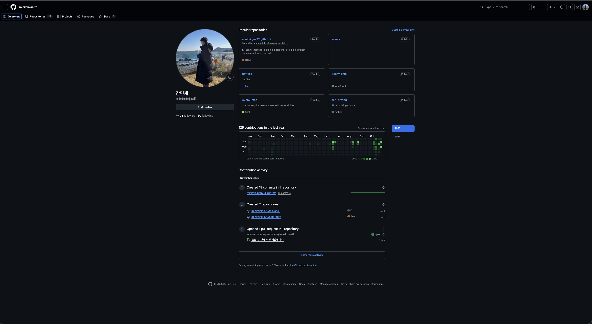

# 우아한테크코스 8기 BE 오픈 미션 회고

지금까지와 다르게 새로운 유형의 미션이 나와서 놀라움과 걱정, 설렘을 동시에 느꼈습니다.
오픈 미션에 대한 내용은 아래와 같습니다.

## 오픈 미션: 프리코스 챌린지

**진행 방식**

- 프리코스 경험 기반으로 관련된 분야의 미션을 설계하고 구현한다.
- 미션 주제는 자유롭게 정한다.
- 스스로 도전하고 싶은 목표를 설정하고, 그에 맞는 실행 계획을 세워 미션을 진행한다.
- 2주 동안 자료 조사, 기획, 실행 후 결과물을 제출한다.

**미션 예시**
- **낯선 도구 해커톤**
  - 설명: 난이도는 평범하나 평소에 잘 사용하지 않는 개발 도구나 언어로 문제를 해결한다.
- **고난도 문제 해커톤**
  - 설명: 평소에 익숙한 기술을 사용하여 난이도가 높은 문제를 해결한다.
- **제한 협업 미션**
  - 설명: 2~3명이 한 팀이 되어 처음 보는 사람과 협업한다.

### 미션을 읽고 나서

**자유롭게, 스스로 도전하고 싶은 목표를 설정, 실행 계획, 결과물 제출**이라는 핵심 키워드를 인지했습니다.
이번 미션은 개인적으로 생각하기에 우테코 측에서 참가자들에게 **스스로 문제를 정의하고 해결해 나가는 모습**을 보고싶어한다는 것을 느꼈습니다.
야생에 홀로 던져진 느낌을 받았고 **"어려운 길을 가라"** 제 삶의 모토와 연결된 미션이라서 좋았습니다.

## 문제 정의

낯선 도구, 고난도 문제, 협업에 대해서 고민하기 전 평소에 스스로에게 정말 해보고 싶었던 것이 무엇이 있었는지?, 불편했던 점에 대해서 문답을 했습니다.
그 중 한 가지는, 평소에 블로깅을 보거나 Github repogitory를 들어가는 일이 많아졌습니다. 
그럴 때마다 깔끔하고 세련되게 정리가 된 것을 보고 멋지다 라고 생각을 했었습니다.

저는 솔직히 배우는 것을 많이 하지만 그에 비하면 기록은 부족한 편이라고 생각했습니다.
시간이 흐르면서 정제된 기록과 나를 표현해주는 명함이 중요한 것을 느꼈고 그것에 대한 갈망이 있었던 것을 이번 오픈 미션에서 새삼 강하게 이끌렸습니다.
느꼈던 감정들을 해결하기 위한 문제를 명시적으로 정리를 해봤습니다.

- **첫 인상에서도 보다 전문적인 느낌을 주고 싶다.**
- **지식을 관리하는 시스템을 확고하게 정하고 플랫폼 변경같은 정신적 소모에 자유롭고 싶다.**

## 목표 설정

위의 문제들을 생각하면서 자료조사에 들어갔고 AI 딥리서치, 대화, 구글링과 개인적인 성향을 파악하면서 정리했습니다.

**세 가지 목표 설정, 낯선 도구 해커톤**

1. 깃헙 Overview 작성
2. 개인 블로그 구축

이번 오픈 미션이 끝났을 때 미션을 떠나서 정말 필요했던 문제를 해결하는 것이라서 미션이 더욱 재밌었습니다.

## Github Overview

- **Before**

  

- **After**

  <video src="2025-11-23-my-blog.m4v" autoPlay loop muted playsInline className="w-full rounded-lg"></video>

<Spacer y={ 4 } />
- **프로젝트 결과물 [Github Overview](https://github.com/miniminjae92/miniminjae92)**

--- 

### 왜? 깃허브 프로필(Overview)인가

개발자에게 Github Overview는 단순한 프로필을 넘어선 **디지털 명함**이라고 느꼈습니다. 단순히 코드를 저장하는 곳이 아니라, 제가 어떤 기술적 여정을 걸어왔고 현재 무엇에 집중하고 있는지 보여주는 살아있는 공간이어야 한다고 생각했습니다. 그래서 '나'라는 개발자를 가장 효과적으로 표현하기 위해 이번 '낯선 도구 해커톤'의 첫 번째 주제로 선정했습니다.

### 자료 조사

깃허브 프로필을 커스터마이징 하기 위해서는 특수 레포지토리(Overview) 생성이 필수적임을 파악했습니다. 먼저 방향성을 잡기 위해 awesome github overview 등의 키워드로 다양한 레퍼런스를 분석했습니다. 짧은 시간 안에 핵심 정보를 전달하기 위해 아래 4가지 질문을 중심으로 정보의 우선순위를 정했습니다.

- **나는 어떤 개발자인가? (Identity)**
- **과거에 무엇을 경험했는가? (Experience)**
- **지금 무엇에 집중하고 있는가? (Current Focus)**
- **나에게 연락할 방법은 무엇인가? (Contact)**

이 4가지 질문을 중심으로 필요한 정보만 압축해 정리했습니다.

### 콘텐츠 기획(글 작성)

디자인 도구보다 텍스트를 먼저 작성하는 전략을 택했습니다.
불필요한 미사여구는 줄이고, 키워드 중심으로 간결하게 작성하는 전략을 취했습니다.
특히 아래 3가지 포인트를 가장 중요하게 고려했습니다.

| 중점                   | 설명                       |
| -------------------- | ------------------------ |
|  **정체성(Identity)** | “무엇을 배우고, 어떤 가치로 개발하는가”  |
|  **실행력(Activity)** | “실제로 어떻게 학습·프로젝트를 진행하는가” |
|  **성장력(Growth)**   | “어떻게 발전해 나가고 있는가”        |

이 기준에 따라 섹션을 나눴습니다.

1. Header — 한 문장으로 나 정의하기
2. About Me — 짧지만 방향성 있는 소개
3. Skills — 기술 목록보다 ‘관심의 맥락’ 강조
4. Projects — 단순 링크가 아니라 “역할 + 목표” 중심
5. Activity — ‘현재성’ 강조
6. Footer — 연결 링크 제공

> 좋은 글은 퇴고에서 나온다.
> 글은 쓰는 것이 아니라 고치는 것이다.

여러 번 쓰고 고치면서 위의 문구가 다시 와닿는 계기가 됐습니다.

<Spacer y={ 4 } />

**구현하며 느낀 점**

Projects, Activity 섹션은 아직 적을거리가 없어서 작성하지 못해 부족한 부분이 무엇인지 분명하게 알 수 있었고 해당 섹션을 채울 수 있도록 해야겠다고 다짐했습니다.

블로그의 최신 글을 연동한 경우를 확인하고 영감을 받았습니다. Github-actions를 사용하면 된다는 글을 확인했는데 추후 블로그 구축도 완성된다면 Actions 학습을 통해 해당 기능을 추가해야겠다고 생각했습니다.

### 디자인 과정

> [참고한 튜토리얼 링크](https://github.com/rzashakeri/beautify-github-profile)

위에 작성한 링크를 알게 됐고 대부분을 해당 링크에 있는 도구들로 간편하게 설정할 수 있었습니다.
해당 Github-README에 작성된 [Awesome Github Profiles](https://zzetao.github.io/awesome-github-profile/)를 적극 활용해서 다른 사람의 프로필을 탐색하는 것에 시간 활용을 많이 했습니다.
다양한 디자인들을 경험하는 것에 초점을 두고 많은 프로필을 보면서 디자인의 방향성과 영감을 얻을 수 있었습니다.

**작업 과정에서 익힌 기술**

- 🧩 Badges 
- 🛠️ Widgets 
- ✅ Icons 

README, Preview를 반복해서 확인하며 하나씩 적용했습니다.
그 과정에서 Markdown 기본 문법, HTML 태그, shields.io 등 사용법에 자연스럽게 익숙해져 갔습니다.

평소에는 학습을 먼저 하고 실습을 하는 성격인데 이번 도전에서는 부딪히며 배우는 방식을 선택했습니다.
그 자체가 저에게 관습을 깨는 경험을 하게 해줘서 힘들었지만 유익한 시간이었습니다.

### 부딪히며 개발

**어려웠던 점**

- 낯선 용어 등장과 이해
- 다양한 이모지와 선택
- 색상과 스타일 설정 변경
- 문구 결정
- Markdown, HTML 모르는 부분들 ex) 주석도.. `<!-- -->`

**배운 점**

프로젝트를 진행하면서 Markdown에서 mark의 의미에 대해서 느끼게 됐습니다.
결국 Markdown도 브라우저에 렌더링 되려면 HTML로 번역되어야한다고 생각이 들었습니다.
Markdown에서 HTML로의 변환과 HTML에서 Markdown으로 변환에 대해서도 생각해보게됐고
Markdown이 더 작은범위인 것을 깨닫고 후자의 경우에는 없는 경우가 발생해서 어렵겠다는 생각도 할 수 있었습니다.
간단하게 쓸때는 Markdown을 쓰되 세밀한 제어는 HTML이 유리할 것 같다는 판단도 들었습니다.

간단하게 가져다 사용하면 될 것처럼 보이지만 원하는대로 색상과 스타일을 조정하려면 색에 대한 이해와 설정들에 대해서도 이해가 필요하다는 것을 느꼈습니다.
제 예상보다 힘든 작업이 됐고 이 계기로 색과 HTML에 대한 관심이 생겼습니다.

## 블로그 구축하기

**프로젝트 결과물 [minjae.log](https://miniminjae.vercel.app/)**

### 기술 스택 선정: 왜 낯선 길을 선택했는가

처음에는 단순히 깃허브 페이지를 고려했습니다. Go 언어에 대한 호기심으로 Hugo를, 성숙한 생태계 때문에 Jekyll을 고민하기도 했습니다. 그러던 중 자료 조사를 통해 SSG(Static Site Generator)라는 개념을 명확히 알게 되었고, React 기반의 Next.js, Gatsby, Astro 등의 존재를 접했습니다.

백엔드 개발자를 지망하지만, "나만의 서비스를 온전히 구축하기 위해서는 **기본적인 프론트엔드 지식과 숙련도 높은 하나의 UI 도구가 필요하다**"는 생각이 늘 있었습니다. 

React라는 키워드에 대해서 들은 경험이 많아서 **React 기반의 Next.js**가 좋겠다는 생각을 하게 됐고, 결국 Hugo에서 Next.js라는 더 넓고 낯선 생태계로 방향을 틀었습니다. 이 과정에서 SSR, SSG 같은 렌더링 방식의 차이도 인지하기 시작했습니다.

### 맨땅에 헤딩: 방대한 선행 학습

시작은 그야말로 혼돈이었습니다. HTML, CSS, JS 기초부터 React, Next.js까지... 모르는 용어의 산이 눈앞에 있었습니다.

_Node.js, npm, yarn, Semantic Tag, DOM, Async/Await, Component, Props, useState, Slug, MDX..._

하나의 용어를 찾으면 또 다른 모르는 용어가 꼬리를 물고 나왔습니다. 저는 깊게 파고들다 지치기보다, **"넓고 얕게, 빠르게 훑기"** 전략을 취했습니다. 웹의 역사, 인터넷과 프로토콜, 브라우저 렌더링 원리부터 클라이언트-서버 구조까지 전체적인 지도를 그리는 데 집중했습니다.

지금 생각해보면 Velite, TailwindCSS, TypeScript 등이 무엇인지 정확히 모른 채, 일단 사용하면서 익히는 무모하지만 확실한 방법을 선택했던 것 같습니다.

### 기획과 디자인: 창조는 모방에서 시작된다

처음엔 `create-next-app` 명령어조차 낯설어 터보팩(Turbopack) 사용 여부, TypeScript 설정 하나하나를 검색하며 진행했습니다. 맨땅에서 디자인을 창조하기엔 역부족임을 깨닫고, 훌륭한 레퍼런스를 찾아 나섰습니다.
특히 [bepyan.me](https://bepyan.me/) 블로그에서 큰 영감을 받았습니다. 디자인과 구성이 제가 원하던 방향과 일치했습니다. 이를 토대로 제가 구현하고 싶은 핵심 기능들을 정리했습니다.

1. 시각적 재미: 마우스 잉크 번짐 효과, 부드러운 호버 인터랙션
2. 사용자 경험: 검색 모달, 깔끔한 뷰 모드 변경, 태그 기반 필터링
3. 정보 구조: 메인에는 '나'에 대한 소개와 최신 글, 카테고리에서는 연도별 아카이빙
4. 분류 전략: 추상화, 스니펫, 환경설정 등을 좋아하는 제 성향에 맞춰 Insight와 Memo로 단순화

GitHub Overview 때와 마찬가지로, **코드를 짜기 전에 블로그에 들어갈 글과 문구, 카테고리 구조를 먼저 기획**했습니다. 콘텐츠가 준비되니 개발의 방향이 명확해졌습니다.

### 구현과 트러블 슈팅 (Troubleshooting)

디자인 구성과 글이 정해지고 나서 개발을 시작했습니다. 이때부터는 구글링과 AI의 도움을 적극적으로 받고 참고했습니다. 제안받은 소스코드에 대해서는 모두 분석하려 노력했고 그 과정에서 시간을 소요하는 경우도 많았습니다. 그리고 제 입맛에 맞게 수정하는 과정에서 수많은 난관에 부딪혔습니다. 그 중 기억에 남는 몇 가지 문제들에 대해서 정리하려 합니다.

#### 개발 환경의 혼란: 패키지 매니저와 Git

**문제 상황:** 처음 개발을 시작했을 때 npm, yarn, pnpm 으로 나뉜 글들을 보고 의아함을 느껴서 조사를 한 후 lock 파일에 대해서 알게 됐고 하나의 도구로 통일 해야겠다는 생각을 갖게 되고 next.js 프로젝트안에 모든 파일들에 대해서 다시 조사를 하게 됐습니다.

**해결 및 배운 점:** 패키지 매니저를 pnpm으로 통일하고, .gitignore를 뒤늦게 설정을 하면서 원격에 이미 올라간 정보를 지우고 다시 커밋하는 법을 배웠습니다. 가장 큰 배운 점은 이것이 무엇인지 **모르면 알려고 하는 것**이 중요하다는 것을 다시 배우게 되어서 좋았습니다.

#### 유지보수의 늪: 컴포넌트화

**문제 상황:** 구현을 하면서 시간이 지날수록 코드의 양은 커져갔습니다. 변경이 잦았는데 그럴 때마다 하나를 수정하려고 여러 파일을 열어 노가다를 반복하고 있었습니다. 

**해결 및 배운 점:** 반복된 노가다 작업을 통해서 누가 시키지 않아도 컴포넌트로 분리하고, 공통 로직을 유틸 함수로 빼내기 시작했습니다. "이래서 컴포넌트를 쓰는구나"를 몸소 체감했고, 컴포넌트가 방대해질 때에는 제가 만든 컴포넌트를 찾는데에도 정신 소모가 발생해서 디렉터리 구조를 고민하며 분류를 새롭게 정하면서 클린코드, 아키텍처에 대한 흥미 또한 올라갔습니다.

#### CSS 레이아웃: 카테고리 페이지

**문제 상황:** 연도별로 글 목록을 나열하는 레이아웃을 잡는 것이 생각보다 어려웠습니다. 아무래도 지식이 부족한 상황에서 AI를 사용하면서 원하는 레이아웃을 잡으려는데 원하는 위치에 요소가 배치되지 않거나 반응형에서 깨지는 문제가 빈번했습니다. 결국 구글링과 원본 소스들을 분석하면서 원하는 레이아웃을 잡을 수 있었습니다.

**해결 및 배운 점:** [TailwindCSS](https://tailwindcss.com/) 공식 문서를 교과서처럼 끼고 살며 flex, grid, position 등 모르는 속성이 나올때마다 `cmd + k`를 눌러대며 공식 문서를 읽어보고 실험을 해봤습니다. 

또한 F12 개발자 도구를 통해서 원인을 찾는 경우가 많았던 것 같았습니다. 이러한 디버깅이 중요할 것 같다고 느꼈고 프로젝트를 진행하면서 조금씩 개발자 도구, globlas.css, TailwindCSS의 편리함을 느끼는 부분이 많았습니다.  

반복되는 적용과 수정을 통해서 CSS에 대한 막연한 두려움이 나아지고, 문서를 통해 문제를 해결하는 능력을 배울 수 있었습니다. 더 디테일한 개발자 도구 사용법에 대한 궁금증도 생겼습니다.

#### UX 디테일: 검색 모달

**문제 상황:** 검색 모달을 구현했는데, 모달이 떴을 때 뒤의 메인 화면이 같이 스크롤 되거나, 배경 비침 문제, ESC 키 외의 영역 클릭 시 닫히지 않는 등 디테일한 사용성 문제가 많았습니다.

**해결 및 배운 점:** 쉽게 해결하는 방법이 있었지만 z-index 40, 50으로 두 개의 레이어로 나누는 해결 방법이 추후 확장성에 유리할 것으로 생각해서 시도했습니다. 이 경험을 통해서 백엔드에서 진행했던 SRP의 중요성이 소프트웨어 개발 전반에서 중요하다는 것을 배웠습니다.

디테일한 마감을 위해서라면 프론트 기술을 좀 더 깊게 알아야한다는 것을 검색 모달 외에도 여러가지 기능을 적용하면서 알게 됐습니다.

#### MDX와 테마 설정

**문제 상황:** 글쓰기의 핵심인 MDX 설정이 어려웠습니다. rehype, remark 플러그인을 설정하는 것도 낯설었지만, 특히 코드 블록(Syntax Highlighting)이 다크/라이트 모드에 대해서 각각 theme을 설정한 경우에는 색상이 제대로 적용되지 경우가 발생했습니다. 그러한 원인을 몰랐고 그래서 상당한 시간을 소모하는 경험을 했습니다. 

복사하기 버튼을 구현하면서 코드 언어가 사라지거나 코드 블럭을 뚫고 코드가 나오는 경우 등 하나의 기능 구현에서도 다양한 소소한 문제들을 경험했습니다.

**해결 및 배운 점:** 테마에 따라 특정 클래스에 CSS 변수를 다르게 매핑해주어야 한다는 것을 알게 되었고, globals.css와 테마 설정을 집요하게 파고들어 해결했습니다. 

소스코드를 분석하고 디버깅하는 능력이 조금의 문제들을 빠르게 해결해줄 수 있다는 것을 배웠습니다.

## 마무리: 발전하는 기록

개발을 진행하며 Insight와 Memo 두 가지 분류만으로는 부족함을 느꼈습니다. 회고같은 분류의 글이 추상화 같은 인사이트, 바로 보고 바로 꺼내 쓰는 Memo에 어디에도 속하지 않는다고 생각해서 시간이 흐르면서 기록된다는 의미를 담아 Log 카테고리를 추가했습니다. 

직접 만든 블로그이기에 분류 체계도, 기능도 언제든 제 필요에 맞춰 유연하게 확장할 수 있다는 점이 큰 매력으로 다가왔습니다. 예를 들면 h1, 2, 3, 4 같은 제목이 같은 크기일 때 가독성 향상이 된다는 것을 느꼈는데 **느끼는 것으로 끝나는 것이 아닌, 적용이 가능하다는 점**이 매력이 상당한 것 같습니다. 

지금 생각해보니 처음 단순 배포만 한 아무정보도 없지만 miniminjae.vercel.app이라는 도메인을 가지고 접속이 가능했을 때 상당한 희열을 느낀 것 같습니다.

수많은 에러 로그와 경험하고 pnpm dev를 끊임없이 입력하며 개선되가는 블로그를 보는 것에서도 큰 보람을 느낄 수 있었고 같은 글을 쓰더라도 더욱 신경써서 쓰게 되는 것 같습니다. 

이번 미션을 통해 얻은 것은 단순히 '블로그'라는 결과물이 아닙니다.

**기술적 통제권**: 소스 코드를 복사하더라도 원리를 이해하고 커스터마이징 할 수 있다는 자신감. 불편한 점이 생기면 언제든 Deep Dive 해서 고칠 수 있다는 확신을 얻었습니다.

**학습 태도 변화**: AI와 구글링에 의존하되, 맹신하지 않고 내 상황에 맞게(Yes/No) 판단하는 법을 익혔습니다.

**지속 가능한 기록**: 이제 저에게는 마음껏 글을 쓰고, 코드를 실험할 수 있는 저만의 지식 정원이 생겼습니다.

<u>김평안(bepyan)</u>님의 블로그가 저에게 이정표가 되어주었듯, 훗날 제 블로그도 누군가에게 영감을 주는 공간으로 발전시키고 싶습니다. 이번 오픈 미션은 저에게 "개발자로서의 나"를 정의하고 표현하는 법을 가르쳐준 소중한 시간이었습니다.

## Reference

- [beautify-github-profile](https://github.com/rzashakeri/beautify-github-profile)
- [Vercel Blog Starter Kit](https://vercel.com/templates/next.js/blog-starter-kit)
- [Tailwind Nextjs Starter Blog](https://github.com/timlrx/tailwind-nextjs-starter-blog)
- [dalelarroder Ref Blog](https://www.dalelarroder.com/) 
- [김평안 Ref Blog](https://bepyan.me/)
- [tailwindcss](https://tailwindcss.com/)
- [react-icons](https://react-icons.github.io/react-icons/)

