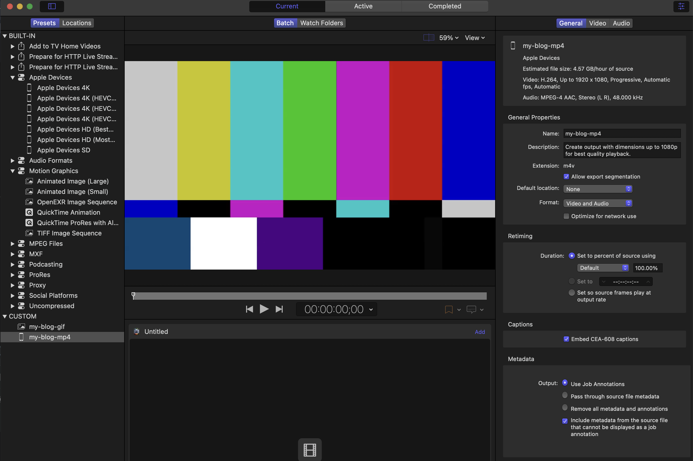

# 블로그에 이미지, 비디오 삽입하기

제 블로그는 Next.js, Mdx, MacOS 기준으로 작성되었습니다.

## 이미지

1. img copy -> 해당 contents 디렉토리에 저장합니다.
2. nerd-tree에서 `y` 키를 사용해서 file name을 복사합니다.
3. dimg snippets 사용합니다.

```mdx
// 사용 예시, max-w-{크기 조절} 
<div className="mx-auto max-w-3xl">
  
</div>

```

## 비디오

**MacOS 기준 GIF, m4v, mp4 쉽게 만드는 방법**

**캡쳐, 녹화 기능**

`Cmd + Shift + 5` 를 누르면 원하는 사이즈로 조정이 가능하고 **Capture or Record를 선택**해서 진행합니다.

**Options**를 통해서 **Timer** 설정도 가능합니다.
종료를 할 때에 단축키 `Cmd + Ctrl + Esc`를 누르면 편리합니다.

**Compressor 도구 사용**

저는 유료 번들이 있어서 Compressor라는 도구를 사용했습니다.

<div class="mx-auto max-w-3xl">
  
</div>

**1단계: Compressor 실행 및 세팅**

1. Compressor 앱을 실행합니다.
2. 왼쪽 상단 패널 펼치는 버튼을 누릅니다.
3. Built-In > Motion Graphics 폴더를 엽니다.
4. **Animated Image (Large)**라는 항목이 보일 겁니다. (이게 고화질 GIF 설정입니다.)
5. 이걸 우클릭하고 **Duplicate(복제)**를 누릅니다.
6. 복제된 설정의 이름을 사용할 이름으로 바꿉니다.

**2단계: 세부 설정 (선택사항)**

`Cmd + 1,2,3,4,5` 키를 사용해서 패널들을 open/close 가능합니다.
원하는 Presets를 클릭하고 `Cmd+4`, 세부 설정 가능합니다.

**3단계: 원하는 위치에 '변환기 아이콘' 만들기**

세팅이 끝난 CUSTOM Preset을 우클릭합니다.
**Save as Droplet... (드롭렛으로 저장)**을 클릭합니다.
저장 위치를 원하느 위치으로 하고 저장하세요.
Location을 Source로 하시면 기존 Source(file) 위치를 기준으로 생성됩니다.

**빠른 작업 루틴 완성**

1. `Cmd + Shift + 5` → 엔터 (녹화 시작)
2. 원하는 동작 수행
3. `Cmd + Ctrl + Esc `(녹화 끝)
4. 바탕화면에 생긴 파일을 아까 만든 Compressor 드롭렛에 툭 던지기

```mdx
/*
* 사용예시
* autoPlay: 페이지가 로딩되자마자 영상을 자동으로 재생합니다.
* loop: 영상이 끝나면 멈추지 않고 처음부터 무한 반복합니다.
* muted: 소리를 음소거 합니다.
* ⚠️ 중요: 브라우저 정책상 소리가 켜져 있으면 autoPlay가 막힙니다. 반드시 넣어야 자동 재생됩니다.
* playsInline: 모바일(특히 아이폰)에서 재생 시 전체 화면으로 커지지 않고, 글 내용 속에 얌전히 포함된 채로 재생되게 합니다.
*/
<div className="mx-auto max-w-2xl">
  <video src="Video URL" autoPlay loop muted playsInline className="w-full rounded-lg"></video>
</div>

```

## 자동화

**LuaSnip**

```lua

local ls = require("luasnip")
local s = ls.snippet
local i = ls.insert_node
local f = ls.function_node
local fmt = require("luasnip.extras.fmt").fmt

return {
	s(
		{ trig = "dimg", desc = "이미지 중앙 정렬 Div" },
		fmt(
			[[
<div className="mx-auto max-w-sm">
  
</div>
]],
			{
				i(2, ""),
				i(1, ""),
			}
		)
	),
	s(
		{ trig = "dvideo", desc = "MP4를 GIF처럼 자동재생 (Video 태그)" },
		fmt(
			[[
<div className="mx-auto max-w-sm">
  <video src="{}" autoPlay loop muted playsInline className="w-full rounded-lg"></video>
</div>
]],
			{
				i(1, "비디오파일경로.mp4"),
			}
		)
	),
}
```


**추천 LazyVim Plugins**

- `HakonHarnes/img-clip.nvim` : 클립보드, 드래그 복사 가능해집니다.


